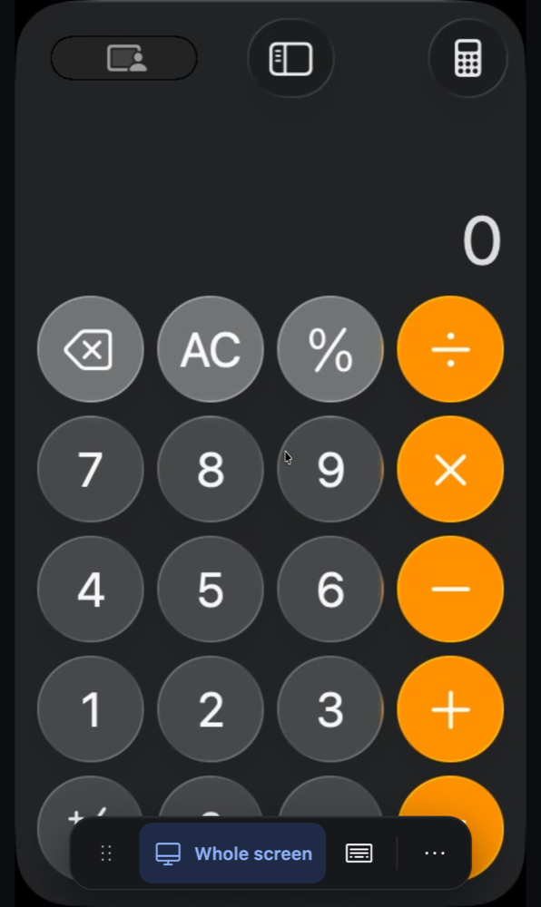
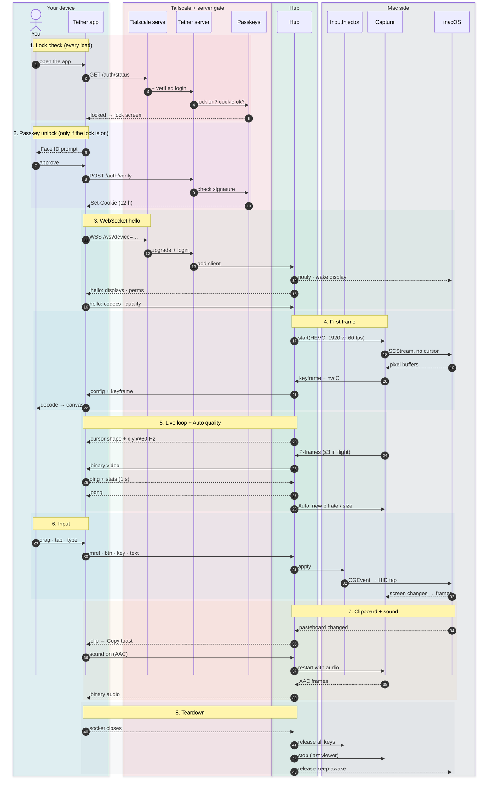
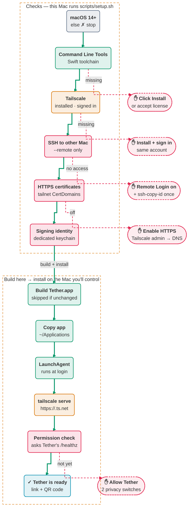

# Tether

**Control your Mac from your iPhone, iPad, or any computer, privately, over Tailscale.**

Tether is a small, free, open-source alternative to apps like Screens. A tiny menu-bar app on your Mac streams the screen to a web page that only *your* devices can open. Add it to your Home Screen and it behaves like an app: sharp, low-latency video, a trackpad-style touch mode, keyboard shortcuts, clipboard sync and file transfer.

<p align="center">
  
</p>

## Set it up with Claude (easiest)

You don't need to be technical. Install [Claude Code](https://claude.com/claude-code), then:

1. On the Mac you want to control, open Terminal. If you're setting up a different Mac, any of your Macs works. Then run:
   ```bash
   xcode-select --install
   ```
   Click **Install** in the window that appears, and wait for it to finish. This installs Apple's free developer tools, which Tether is built with. If it says they're already installed, move on.
2. Then run:
   ```bash
   git clone https://github.com/jordanromines-jpg/tether.git && cd tether && claude
   ```
3. Tell Claude: **"Set up Tether on my Mac."**

Claude runs the setup, explains each step, and tells you when it needs you. That includes installing Tailscale and turning on two permission switches in System Settings. Setup takes about 20–30 minutes, mostly waiting for the first build.

## Set it up yourself

Requirements:
- A Mac running macOS 14 (Sonoma) or newer.
- A free [Tailscale](https://tailscale.com) account.

Steps:
1. Run this from the repo folder:
   ```bash
   scripts/setup.sh                                  # make THIS Mac controllable
   scripts/setup.sh --remote you@other-mac           # or set up ANOTHER Mac on your tailnet over SSH
   scripts/setup.sh --check                          # read-only: see what's done and what's left
   ```
   The script stops with **ACTION NEEDED** whenever you need to do something, such as clicking Install or flipping a permission. Do it, then run the same command again.

   When it reaches macOS permissions, the **Tether Setup Assistant** opens on the Mac. It walks you through Screen Recording and Accessibility with checkmarks that turn green by themselves, checks Tailscale, shows a QR code for your phone, and lets you pick where the Tether shortcut goes.
2. Shortcuts. Setup puts a **Tether** shortcut in Applications, so you can start Tether again after quitting it. To choose another folder, pass `--shortcut-dir <folder>`, or skip it with `--no-shortcut`. You can also make one later:
   ```bash
   scripts/shortcut.sh app                    # a Tether shortcut (pick a folder; Applications by default)
   scripts/shortcut.sh viewer studio          # on the Mac you control FROM: a "Tether - studio" app that opens that Mac's screen
   ```
   The viewer app opens the screen in its own window (Chrome, Edge or Brave app mode, otherwise your default browser).
3. On each phone, tablet or computer you'll control from:
   1. Install Tailscale and sign in with the **same account**.
   2. Open the link setup printed, `https://<your-mac>.<tailnet>.ts.net`. The Tether menu-bar icon also has **Show QR code for your phone…**
   3. On iPhone or iPad, tap Share → **Add to Home Screen**.

## Using it

| | Touch (iPhone / iPad) | Mouse, trackpad and keyboard |
|---|---|---|
| Move | Drag one finger (trackpad mode) or tap where you want (direct mode) | Move the pointer |
| Click / right-click | Tap / two-finger tap | Click / right-click |
| Drag | Touch and hold, then drag | Click and drag |
| Scroll | Two fingers | Wheel or trackpad |
| Spaces / Mission Control | Three-finger swipe left/right, or up/down | Use the shortcuts menu (**…**) |
| Zoom the view | Pinch. The view follows the cursor; three fingers pan while zoomed | n/a |
| Type | ⌨︎ for keys and shortcuts, or **Compose** for autocorrect and dictation | Just type; ⌘ shortcuts pass through |

The toolbar also has:
- **Quick actions** (the lightning bolt): volume, mute, play/pause, next and previous track, Mission Control, sleep the Mac's display, lock the Mac (tap twice), take a **screenshot** to your device, **open a link** on the Mac, **open an app** by name, Force Quit, and the full **keys and shortcuts** list.
- **Names for everything:** hover over a button, or touch and hold it on a phone or iPad, to see what it does.
- **Put it anywhere:** drag the toolbar by its grip (the dots on the end) to any edge or corner. On the sides it stands upright. Or choose **More → Move toolbar**.
- **More:** buttons that don't fit on a small screen move into **More** instead of scrolling off the edge. **Tips** are there too.
- **Sticky ⌘ ⌥ ⌃ ⇧:** tap for the next key only, double-tap to lock.
- **Keys and shortcuts** for Esc, arrows, F-keys and common shortcuts.
- **Clipboard** sync in both directions, including formatted text and **images** (copy an image on the Mac and tap Copy on your phone; or **Paste image** to send one from your phone).
- **Windows:** a list of the Mac's open windows with their app icons. Tap one to bring it to the front, or **Show only** to stream just that window, which is far easier to use on a phone than a whole 5K desktop. **Fit to this device** reshapes the window to your screen while you use it and puts it back afterwards. Tap **Whole screen** in the toolbar to go back.
- **Your Macs** (More, or the connection details): every Mac on your tailnet with a live picture, and whether it's online, paused, not answering, or offline since when. Tap one to switch.
- **Pinned shortcuts:** in Keys and shortcuts, choose **Pin to toolbar** to put up to six shortcuts (or your own combination) right on the toolbar.
- **Capture pointer** (More, on a computer or an iPad with a trackpad): your trackpad moves the Mac's pointer directly. Press Esc to release it.
- **Files:** browse the Mac's Downloads, Desktop and Documents; download anything, or **Upload here** to put files in the folder you're looking at. (Files dropped onto the window go to Downloads.)
- **Sound** on or off.
- **Display and quality:** pick a monitor (with a live picture of each when there's more than one); choose Auto, **Saver** (battery and cellular), Fast, Balanced or Sharp; fit the screen to your device; pause when idle; pointer size and the **magnifier** (a zoomed view above your finger while dragging) on touch screens; a **data warning** after 250 MB, 500 MB or 1 GB; and **this device's name** as the Mac shows it.
- **Connection:** your Mac's name with a live quality dot and how much data this session and today have used. Tap it for details, or to switch to another of your Macs running Tether.

## Turning it on and off

Tether lives in your Mac's menu bar. Setup makes it start automatically when you log in. Click its icon for the status panel: who's connected (with a **Disconnect** button for each, and whether they're viewing only or idle), **Recent activity** (who connected, from which device, when and for how long), your link and QR code, the passkey lock with each device's passkey (remove one and every device unlocks again), **Setup Assistant…** and **Add a shortcut…**. Right-click the icon for the classic menu.

- **Pause remote access:** the switch at the top of the panel, or **Pause** in the right-click menu (⌘P). Everyone is disconnected and nobody can connect until you choose **Resume**. Your phone shows "Paused on the Mac" and reconnects by itself when you resume. Pausing survives restarts.
- **Quit Tether:** Tether stops completely and stays off. To start it again, open the **Tether** shortcut in Applications, or find Tether in Spotlight.
- **Start Tether at login:** a checkbox in the menu. Turn it off if you'd rather start Tether yourself.
- **Pause when idle:** a device that hasn't been touched for 15 minutes stops streaming and shows "Paused to save power"; tap to carry on. Choose 5, 15 or 30 minutes, or Never, in **Display and quality**. It doesn't happen while sound is playing or in view only. A page that goes into the background pauses too (straight away on a phone, after a minute on a computer) and reconnects when you come back. With the passkey lock on, resuming asks for Face ID again. For testing, add `?idle=0.25` to the link to pause after 15 seconds.
- **View only:** **More → View only** lets you watch without controlling. The Mac ignores that device's clicks and typing.
- **Curtain:** **More → Curtain** blacks out the Mac's own screen while you work, so people in the room can't see. You still see everything. Anyone at the Mac can lift it with ⌃⌥⌘ Return, and it turns off when everyone disconnects.
- **Help:** **More → Help and docs** (or **Help and docs** in the Mac's panel) opens this page; **Report a problem** opens a GitHub issue.
- **While nobody is connected,** Tether isn't recording the screen or watching the clipboard. It just waits for a connection. If it ever crashes, it restarts by itself.
- **To remove it completely,** run `scripts/uninstall.sh` (this Mac) or `scripts/uninstall.sh <name>` (another Mac you set up). It also removes the shortcuts Tether made. Add `--all` to also delete its settings and passkeys.

## Updating

The Tether panel on the Mac shows **Update available** when a newer version is on GitHub (it checks once a day; untick **Check for updates** to stop). To update:

- **This Mac:** in the Tether folder, run `git pull` and then `scripts/setup.sh`. Or ask Claude: *"update Tether on this Mac"*.
- **Another Mac you set up:** `git pull`, then `scripts/deploy.sh <name>`.

Your settings, passkeys and macOS permissions are kept.

## How it stays private

- **Only devices on your Tailscale network can reach it.** Everyone else on the internet can't connect at all.
- **Only your Tailscale login is allowed in.** Each request carries an identity Tailscale verifies, and Tether checks it.
- **Optional second lock:** a Face ID / Touch ID passkey. Turn it on from the Tether menu-bar icon. You'll see a banner on the Mac whenever a device connects, and the menu lists active sessions with **Disconnect all**.

Details, including what to do if a device is lost: [SECURITY.md](SECURITY.md).

## How it works

Three diagrams map Tether end to end, top to bottom. All of them stay sharp at any zoom: the session and setup diagrams are drawn by GitHub itself (use the expand button to pan), and the architecture is a vector image.

Each has an **[interactive version](https://jordanromines-jpg.github.io/tether/)** made with [Archify](https://github.com/tt-a1i/archify). There you can click any box to see the exact file and lines that implement it, trace paths, and switch guided views.

### 1. System architecture

Every component and every link, from your device at the top, through Tailscale and the identity gate, to the agent's routes, the Hub that feeds every viewer from one capture, the capture and input engines, and macOS at the bottom. This one is a vector image rather than a live Mermaid block: it uses Mermaid's ELK layout engine, which untangles a map this dense, and GitHub's built-in Mermaid doesn't include ELK.

**Colours:**
- cyan: your device
- green: app logic
- rose: security
- violet: storage
- slate: outside systems
- amber: cloud

**Lines:**
- bold green: the main path
- dashed red: security checks
- dashed grey: returns

<a href="https://jordanromines-jpg.github.io/tether/diagrams/architecture-elk-light.svg"><picture>
  <source media="(prefers-color-scheme: dark)" srcset="docs/diagrams/architecture-elk-dark.svg">
  
</picture></a>

**[View the full-size graphic](https://jordanromines-jpg.github.io/tether/diagrams/architecture-elk-light.svg)** ([dark version](https://jordanromines-jpg.github.io/tether/diagrams/architecture-elk-dark.svg)). It's vector, so zoom in as far as you like. Or **[open the interactive architecture map →](https://jordanromines-jpg.github.io/tether/diagrams/architecture.html)**, where you can click any box for its source code.

### 2. One session, step by step

A whole session read top to bottom, as 43 numbered steps in eight shaded phases:
1. lock check
2. passkey unlock
3. WebSocket hello
4. first frame
5. the live loop with Auto quality
6. input
7. clipboard and sound
8. teardown

The columns are grouped by who acts: your device, Tailscale and the server gate, the Hub, and the Mac side.

[Open the interactive session timeline →](https://jordanromines-jpg.github.io/tether/diagrams/session.html)

<!-- mermaid:session -->


### 3. Setup

What `scripts/setup.sh` checks, builds and installs. The ✋ boxes are the moments it stops and waits for you; run it again afterwards and it carries on.

[Open the interactive setup flow →](https://jordanromines-jpg.github.io/tether/diagrams/setup.html)

<!-- mermaid:setup -->


### Code layout

- `agent/`: the Swift menu-bar app. It captures the screen, encodes it with the hardware encoder in low-latency mode, injects input, and adapts quality to your connection. `TetherUI` holds the SwiftUI status panel and Setup Assistant.
- `web/`: the client. Plain JavaScript modules with no build step, installable to the Home Screen.
- `docs/DESIGN.md`: colours, type, icons, motion and copy rules for both the client and the Mac app.
- `scripts/`: the setup, build, signing and update scripts.
- `CLAUDE.md`: the runbook Claude follows.
- `docs/diagrams/`: the diagrams. `src/*.json` are the Archify sources for the interactive versions; rebuild one with `archify finalize <type> docs/diagrams/src/<name>.json <out>.html --repo-root .`. The README's Mermaid diagrams are generated from the same sources by `python3 docs/diagrams/make_mermaid.py`, and `docs/diagrams/render_svg.sh` renders the architecture's ELK version to `architecture-elk-{light,dark}.svg`.

## Development

```bash
swift run --package-path agent SelfTest   # core logic tests
node --test web/tests/*.test.mjs          # client logic tests (toolbar docking and folding)
swift run --package-path agent Snapshots snaps/   # render the Mac UI to PNGs (light and dark) for review
scripts/dev.sh                            # run the agent on this Mac at http://localhost:7400 (dev mode)
scripts/build-app.sh                      # build/Tether.app, signed with a stable local identity
scripts/deploy.sh <target>                # update another Mac (targets live in ~/.config/tether/targets/)
scripts/uninstall.sh [<target>] [--all]   # remove Tether from this Mac or another one
```

Logs on the controlled Mac are in `~/Library/Logs/Tether.log`.

## Known limits

- **You build it yourself, from source.** There's no signed or notarized download. Setup builds Tether on your Mac and signs it with a self-made identity kept in a dedicated keychain, so macOS permissions survive updates. If you build on a different Mac or delete that keychain, grant the two permissions once more.
- **Browser-reserved shortcuts.** Desktop browsers keep a few shortcuts for themselves (⌘W, ⌘T, ⌘Q). Use the **…** menu, or install the page as an app.
- **"Fit to device" uses an undocumented macOS feature.** A future macOS update could break it. If so, the toggle disables itself, and everything else keeps working.
- **Future ideas:** WebRTC transport for lossy networks, and a signed one-click download.

## License

MIT. See [LICENSE](LICENSE).
