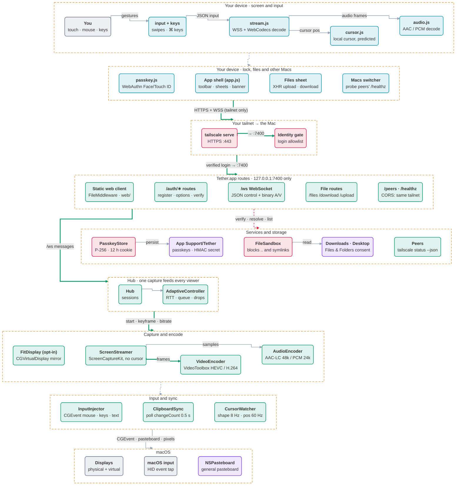
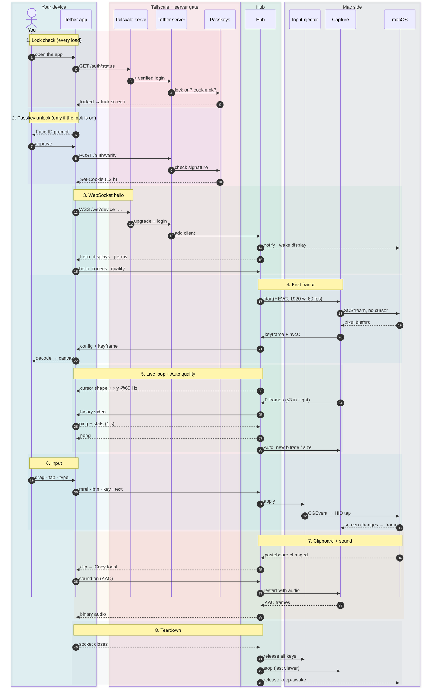

# Tether

**Control your Mac from your iPhone, iPad, or any computer, privately, over Tailscale.**

Tether is a small, free, open-source alternative to apps like Screens. A tiny menu-bar app on your Mac streams the screen to a web page that only *your* devices can open. Add it to your Home Screen and it behaves like an app: sharp, low-latency video, a trackpad-style touch mode, keyboard shortcuts, clipboard sync and file transfer.

<!-- Screenshot: docs/screenshot-iphone.png -->

## Set it up with Claude (easiest)

You don't need to be technical. Install [Claude Code](https://claude.com/claude-code), then:

1. On the Mac you want to control, open Terminal. If you're setting up a different Mac, any of your Macs works. Then run:
   ```bash
   xcode-select --install
   ```
   Click **Install** in the window that appears, and wait for it to finish. This installs Apple's free developer tools, which Tether is built with. If it says they're already installed, move on.
2. Then run:
   ```bash
   git clone https://github.com/jordanromines-jpg/tether.git && cd tether && claude
   ```
3. Tell Claude: **"Set up Tether on my Mac."**

Claude runs the setup, explains each step, and tells you when it needs you. That includes installing Tailscale and turning on two permission switches in System Settings. Setup takes about 20–30 minutes, mostly waiting for the first build.

## Set it up yourself

Requirements:
- A Mac running macOS 14 (Sonoma) or newer.
- A free [Tailscale](https://tailscale.com) account.

Steps:
1. Run this from the repo folder:
   ```bash
   scripts/setup.sh                                  # make THIS Mac controllable
   scripts/setup.sh --remote you@other-mac           # or set up ANOTHER Mac on your tailnet over SSH
   scripts/setup.sh --check                          # read-only: see what's done and what's left
   ```
   The script stops with **ACTION NEEDED** whenever you need to do something, such as clicking Install or flipping a permission. Do it, then run the same command again.
2. On each phone, tablet or computer you'll control from:
   1. Install Tailscale and sign in with the **same account**.
   2. Open the link setup printed, `https://<your-mac>.<tailnet>.ts.net`. The Tether menu-bar icon also has **Show QR code for your phone…**
   3. On iPhone or iPad, tap Share → **Add to Home Screen**.

## Using it

| | Touch (iPhone / iPad) | Mouse, trackpad and keyboard |
|---|---|---|
| Move | Drag one finger (trackpad mode) or tap where you want (direct mode) | Move the pointer |
| Click / right-click | Tap / two-finger tap | Click / right-click |
| Drag | Touch and hold, then drag | Click and drag |
| Scroll | Two fingers | Wheel or trackpad |
| Spaces / Mission Control | Three-finger swipe left/right, or up/down | Use the shortcuts menu (**…**) |
| Zoom the view | Pinch. The view follows the cursor; three fingers pan while zoomed | n/a |
| Type | ⌨︎ for keys and shortcuts, or **Compose** for autocorrect and dictation | Just type; ⌘ shortcuts pass through |

The toolbar also has:
- **Sticky ⌘ ⌥ ⌃ ⇧:** tap for the next key only, double-tap to lock.
- **…** for Esc, arrows, F-keys and common shortcuts.
- **Clipboard** sync in both directions.
- **Files:** send files to the Mac's Downloads folder, or download from its Downloads and Desktop.
- **Sound** on or off.
- **Display & quality:** pick a monitor, choose Auto, Fast, Balanced or Sharp, fit the screen to your device, or switch to another of your Macs running Tether.

## Turning it on and off

Tether lives in your Mac's menu bar. Setup makes it start automatically when you log in.

- **Pause remote access:** in the Tether menu, or press ⌘P with the menu open. Everyone is disconnected and nobody can connect until you choose **Resume**. Your phone shows "Paused on the Mac" and reconnects by itself when you resume. Pausing survives restarts.
- **Quit Tether:** Tether stops completely and stays off. To start it again, open **Tether** from the Applications folder in your home folder, or from Spotlight.
- **Start Tether at login:** a checkbox in the menu. Turn it off if you'd rather start Tether yourself.
- **While nobody is connected,** Tether isn't recording the screen or watching the clipboard. It just waits for a connection. If it ever crashes, it restarts by itself.
- **To remove it completely,** run `scripts/uninstall.sh` (this Mac) or `scripts/uninstall.sh <name>` (another Mac you set up). Add `--all` to also delete its settings and passkeys.

## How it stays private

- **Only devices on your Tailscale network can reach it.** Everyone else on the internet can't connect at all.
- **Only your Tailscale login is allowed in.** Each request carries an identity Tailscale verifies, and Tether checks it.
- **Optional second lock:** a Face ID / Touch ID passkey. Turn it on from the Tether menu-bar icon. You'll see a banner on the Mac whenever a device connects, and the menu lists active sessions with **Disconnect all**.

Details, including what to do if a device is lost: [SECURITY.md](SECURITY.md).

## How it works

Three diagrams map Tether end to end, top to bottom. GitHub draws them right here, so they stay sharp at any zoom; use the expand button to pan around.

Each has an **[interactive version](https://jordanromines-jpg.github.io/tether/)** made with [Archify](https://github.com/tt-a1i/archify). There you can click any box to see the exact file and lines that implement it, trace paths, and switch guided views.

### 1. System architecture

From your device at the top, through Tailscale and the identity gate, to the agent's routes, the Hub that feeds every viewer from one capture, the capture and input engines, and macOS at the bottom.

**Colours:**
- cyan: your device
- green: app logic
- rose: security
- violet: storage
- slate: outside systems
- amber: cloud

**Lines:**
- bold green: the main path
- dashed red: security checks
- dashed grey: returns

[Open the interactive architecture map →](https://jordanromines-jpg.github.io/tether/diagrams/architecture.html)

<!-- mermaid:architecture -->


### 2. One session, step by step

A whole session read top to bottom, as 43 numbered steps in eight shaded phases:
1. lock check
2. passkey unlock
3. WebSocket hello
4. first frame
5. the live loop with Auto quality
6. input
7. clipboard and sound
8. teardown

The columns are grouped by who acts: your device, Tailscale and the server gate, the Hub, and the Mac side.

[Open the interactive session timeline →](https://jordanromines-jpg.github.io/tether/diagrams/session.html)

<!-- mermaid:session -->


### 3. Setup

What `scripts/setup.sh` checks, builds and installs. The ✋ boxes are the moments it stops and waits for you; run it again afterwards and it carries on.

[Open the interactive setup flow →](https://jordanromines-jpg.github.io/tether/diagrams/setup.html)

<!-- mermaid:setup -->


### Code layout

- `agent/`: the Swift menu-bar app. It captures the screen, encodes it with the hardware encoder in low-latency mode, injects input, and adapts quality to your connection.
- `web/`: the client. Plain JavaScript modules with no build step, installable to the Home Screen.
- `scripts/`: the setup, build, signing and update scripts.
- `CLAUDE.md`: the runbook Claude follows.
- `docs/diagrams/`: the diagrams. `src/*.json` are the Archify sources for the interactive versions; rebuild one with `archify finalize <type> docs/diagrams/src/<name>.json <out>.html --repo-root .`. The README's Mermaid diagrams are generated from the same sources by `python3 docs/diagrams/make_mermaid.py`.

## Development

```bash
swift run --package-path agent SelfTest   # core logic tests
scripts/dev.sh                            # run the agent on this Mac at http://localhost:7400 (dev mode)
scripts/build-app.sh                      # build/Tether.app, signed with a stable local identity
scripts/deploy.sh <target>                # update another Mac (targets live in ~/.config/tether/targets/)
scripts/uninstall.sh [<target>] [--all]   # remove Tether from this Mac or another one
```

Logs on the controlled Mac are in `~/Library/Logs/Tether.log`.

## Known limits

- **You build it yourself, from source.** There's no signed or notarized download. Setup builds Tether on your Mac and signs it with a self-made identity kept in a dedicated keychain, so macOS permissions survive updates. If you build on a different Mac or delete that keychain, grant the two permissions once more.
- **Browser-reserved shortcuts.** Desktop browsers keep a few shortcuts for themselves (⌘W, ⌘T, ⌘Q). Use the **…** menu, or install the page as an app.
- **"Fit to device" uses an undocumented macOS feature.** A future macOS update could break it. If so, the toggle disables itself, and everything else keeps working.
- **Future ideas:** WebRTC transport for lossy networks, and a signed one-click download.

## License

MIT. See [LICENSE](LICENSE).
