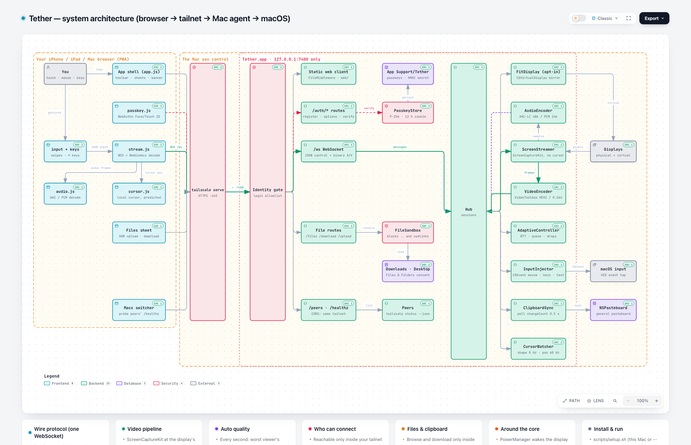
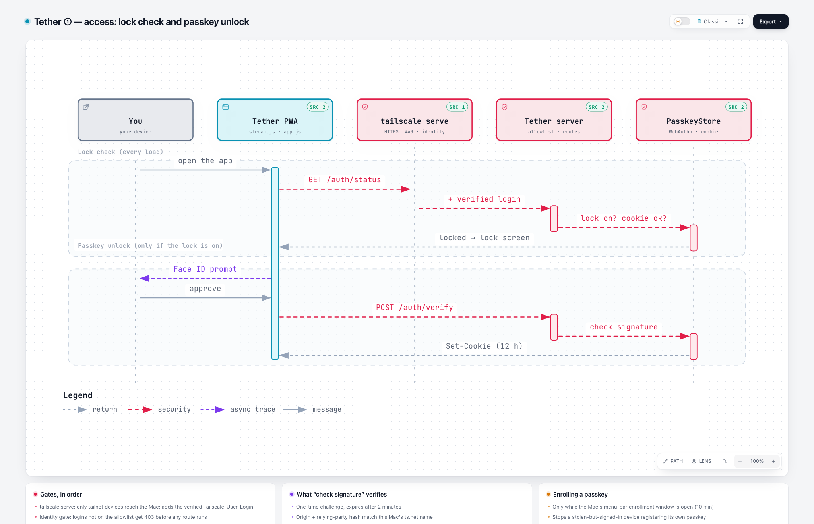
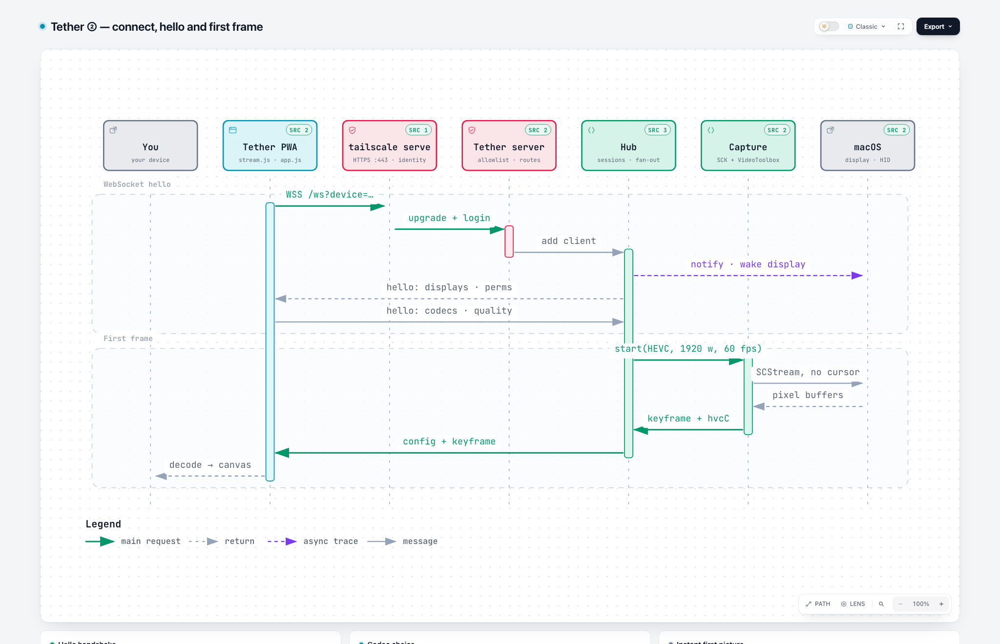
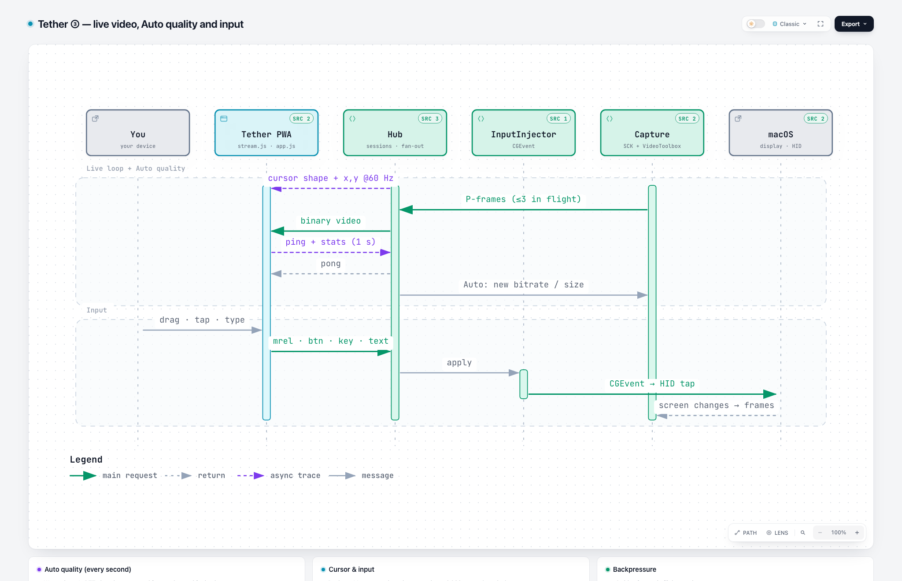
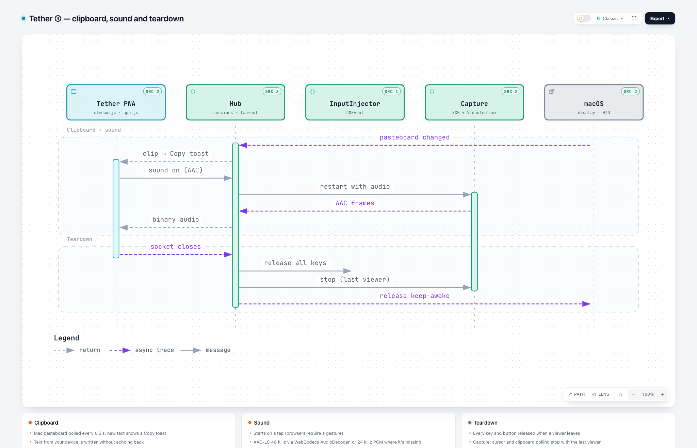
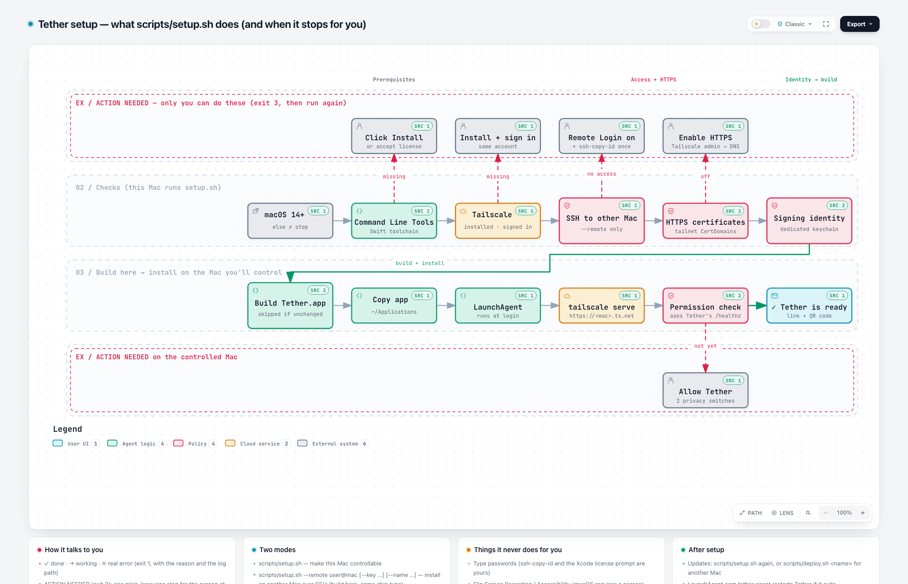

# Tether

**Control your Mac from your iPhone, iPad, or any computer, privately, over Tailscale.**

Tether is a small, free, open-source alternative to apps like Screens. A tiny menu-bar app on your Mac streams the screen to a web page that only *your* devices can open. Add it to your Home Screen and it behaves like an app: sharp, low-latency video, a trackpad-style touch mode, keyboard shortcuts, clipboard sync and file transfer.

<!-- Screenshot: docs/screenshot-iphone.png -->

## Set it up with Claude (easiest)

You don't need to be technical. Install [Claude Code](https://claude.com/claude-code), then:

1. On the Mac you want to control, open Terminal. If you're setting up a different Mac, any of your Macs works. Then run:
   ```bash
   xcode-select --install
   ```
   Click **Install** in the window that appears, and wait for it to finish. This installs Apple's free developer tools, which Tether is built with. If it says they're already installed, move on.
2. Then run:
   ```bash
   git clone https://github.com/jordanromines-jpg/tether.git && cd tether && claude
   ```
3. Tell Claude: **"Set up Tether on my Mac."**

Claude runs the setup, explains each step, and tells you when it needs you. That includes installing Tailscale and turning on two permission switches in System Settings. Setup takes about 20–30 minutes, mostly waiting for the first build.

## Set it up yourself

Requirements:
- A Mac running macOS 14 (Sonoma) or newer.
- A free [Tailscale](https://tailscale.com) account.

Steps:
1. Run this from the repo folder:
   ```bash
   scripts/setup.sh                                  # make THIS Mac controllable
   scripts/setup.sh --remote you@other-mac           # or set up ANOTHER Mac on your tailnet over SSH
   scripts/setup.sh --check                          # read-only: see what's done and what's left
   ```
   The script stops with **ACTION NEEDED** whenever you need to do something, such as clicking Install or flipping a permission. Do it, then run the same command again.
2. On each phone, tablet or computer you'll control from:
   1. Install Tailscale and sign in with the **same account**.
   2. Open the link setup printed, `https://<your-mac>.<tailnet>.ts.net`. The Tether menu-bar icon also has **Show QR code for your phone…**
   3. On iPhone or iPad, tap Share → **Add to Home Screen**.

## Using it

| | Touch (iPhone / iPad) | Mouse, trackpad and keyboard |
|---|---|---|
| Move | Drag one finger (trackpad mode) or tap where you want (direct mode) | Move the pointer |
| Click / right-click | Tap / two-finger tap | Click / right-click |
| Drag | Touch and hold, then drag | Click and drag |
| Scroll | Two fingers | Wheel or trackpad |
| Spaces / Mission Control | Three-finger swipe left/right, or up/down | Use the shortcuts menu (**…**) |
| Zoom the view | Pinch. The view follows the cursor; three fingers pan while zoomed | n/a |
| Type | ⌨︎ for keys and shortcuts, or **Compose** for autocorrect and dictation | Just type; ⌘ shortcuts pass through |

The toolbar also has:
- **Sticky ⌘ ⌥ ⌃ ⇧:** tap for the next key only, double-tap to lock.
- **…** for Esc, arrows, F-keys and common shortcuts.
- **Clipboard** sync in both directions.
- **Files:** send files to the Mac's Downloads folder, or download from its Downloads and Desktop.
- **Sound** on or off.
- **Display & quality:** pick a monitor, choose Auto, Fast, Balanced or Sharp, fit the screen to your device, or switch to another of your Macs running Tether.

## How it stays private

- **Only devices on your Tailscale network can reach it.** Everyone else on the internet can't connect at all.
- **Only your Tailscale login is allowed in.** Each request carries an identity Tailscale verifies, and Tether checks it.
- **Optional second lock:** a Face ID / Touch ID passkey. Turn it on from the Tether menu-bar icon. You'll see a banner on the Mac whenever a device connects, and the menu lists active sessions with **Disconnect all**.

Details, including what to do if a device is lost: [SECURITY.md](SECURITY.md).

## How it works

Six diagrams map Tether end to end. They're generated with [Archify](https://github.com/tt-a1i/archify) from the source code: every box links to the exact file and lines that implement it, pinned to a commit.

Each picture links to an **interactive version** (download the `.html` and open it in a browser). There you can:
- click any box to see its source links;
- trace a path through the system;
- switch between guided views such as *Video path*, *Input path* and *Who can connect*;
- toggle light and dark mode, or export.

### 1. System architecture

Everything that runs, where it runs, and how it connects: your device's browser app, Tailscale, the identity gate, the agent's routes, the Hub that feeds every viewer from one capture, the capture and input engines, and the macOS pieces they touch.

<a href="docs/diagrams/architecture.html"><picture>
  <source media="(prefers-color-scheme: dark)" srcset="docs/diagrams/architecture-dark.png">
  
</picture></a>

### 2. One session, step by step

A real session, split across four sequence diagrams.

**① Access:** the lock check on every load, and the optional Face ID / Touch ID passkey unlock.

<a href="docs/diagrams/sequence-1-access.html"><picture>
  <source media="(prefers-color-scheme: dark)" srcset="docs/diagrams/sequence-1-access-dark.png">
  
</picture></a>

**② Connect:** the WebSocket handshake, codec negotiation (HEVC or H.264) and the instant first frame.

<a href="docs/diagrams/sequence-2-connect.html"><picture>
  <source media="(prefers-color-scheme: dark)" srcset="docs/diagrams/sequence-2-connect-dark.png">
  
</picture></a>

**③ Live:** the video loop with backpressure, the cursor drawn on your device, Auto quality, and how a tap becomes a real macOS event.

<a href="docs/diagrams/sequence-3-live.html"><picture>
  <source media="(prefers-color-scheme: dark)" srcset="docs/diagrams/sequence-3-live-dark.png">
  
</picture></a>

**④ Extras:** clipboard sync, sound, and what gets cleaned up when you disconnect.

<a href="docs/diagrams/sequence-4-extras.html"><picture>
  <source media="(prefers-color-scheme: dark)" srcset="docs/diagrams/sequence-4-extras-dark.png">
  
</picture></a>

### 3. Setup

What `scripts/setup.sh` checks, builds and installs, and exactly where it stops and waits for you.

<a href="docs/diagrams/setup.html"><picture>
  <source media="(prefers-color-scheme: dark)" srcset="docs/diagrams/setup-dark.png">
  
</picture></a>

### Code layout

- `agent/`: the Swift menu-bar app. It captures the screen, encodes it with the hardware encoder in low-latency mode, injects input, and adapts quality to your connection.
- `web/`: the client. Plain JavaScript modules with no build step, installable to the Home Screen.
- `scripts/`: the setup, build, signing and update scripts.
- `CLAUDE.md`: the runbook Claude follows.
- `docs/diagrams/`: the diagrams above, plus their Archify sources in `src/`. To regenerate one, run `archify finalize <type> docs/diagrams/src/<name>.json <out>.html --repo-root .`

## Development

```bash
swift run --package-path agent SelfTest   # core logic tests
scripts/dev.sh                            # run the agent on this Mac at http://localhost:7400 (dev mode)
scripts/build-app.sh                      # build/Tether.app, signed with a stable local identity
scripts/deploy.sh <target>                # update another Mac (targets live in ~/.config/tether/targets/)
```

Logs on the controlled Mac are in `~/Library/Logs/Tether.log`.

## Known limits

- **You build it yourself, from source.** There's no signed or notarized download. Setup builds Tether on your Mac and signs it with a self-made identity kept in a dedicated keychain, so macOS permissions survive updates. If you build on a different Mac or delete that keychain, grant the two permissions once more.
- **Browser-reserved shortcuts.** Desktop browsers keep a few shortcuts for themselves (⌘W, ⌘T, ⌘Q). Use the **…** menu, or install the page as an app.
- **"Fit to device" uses an undocumented macOS feature.** A future macOS update could break it. If so, the toggle disables itself, and everything else keeps working.
- **Future ideas:** WebRTC transport for lossy networks, and a signed one-click download.

## License

MIT. See [LICENSE](LICENSE).
